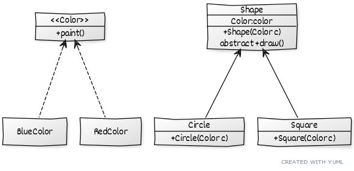
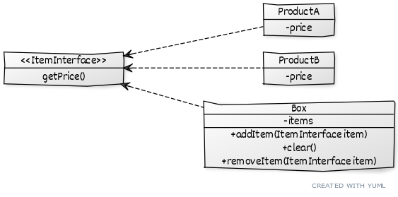
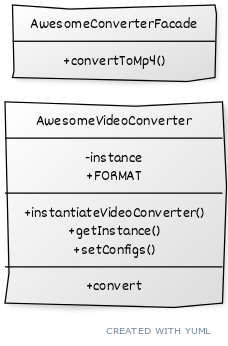

# Design patterns

As Wikipedia states "in software engineering, a software design pattern is a general, reusable solution to a commonly occurring problem within a given context in software design. It is not a finished design that can be transformed directly into source or machine code. Rather, it is a description or template for how to solve a problem that can be used in many different situations. Design patterns are formalized best practices that the programmer can use to solve common problems when designing an application or system."

They are divided in 3 sub-categories: 
* Creational patterns provide the capability to create objects based on a required criterion and in a controlled way 
* Structural patterns are about organizing different classes and objects to form larger structures and provide new functionality
* Behavioral patterns are about identifying common communication patterns between objects and realize these patterns.

<a name="index"></a>
1. Creational patterns
    1. [Factory pattern](#factory)
    2. [Abstract Factory](#abstractfactory)
    3. [Builder](#builder)
    4. [Prototype](#prototype)
    5. [Singleton](#singleton)
2. Structural patterns
    1. [Adapter](#adapter)
    2. [Bridge](#bridge)
    3. [Composite](#composite)
    4. [Decorator](#decorator)
    5. [Facade](#facade)
    6. [Flyweight](#flyweight)


---

## Creational patterns

<a name="factory"></a> 
### Factory pattern [\^](#index)

### Description
Factory Method is a creational design pattern that provides an interface for creating objects in a superclass, but allows subclasses to alter the type of objects that will be created.

#### Problem
You have a logistic application - everything is transported by trucks so all the code lives in `Truck` class.

After some time the application becomes pretty popular, so you add the transport by ship method, which will use `Ship` class. Adding this new transportation method requires editing the whole codebase as it's coupled with `Truck` class. And when it's needed to add more transport method?

### Solution
The factory method suggest that the object creation is moved from the constructor to a special method called *factory*.

We write the `TransportInterface` interface with `sendPackage()` method. The `Truck` and `Ship` classes will extend this interface.

**TransportInterface**:
```java
public interface TransportInterface {	

	public void sendPackage();

}
```

**Truck**:
```java
public class Truck implements TransportInterface {
	
	// field, getters and setters

	@Override
	public void sendPackage() {
		System.out.println("Sending package via truck!");
	}

}
```

**Ship**:
```java
public class Ship implements TransportInterface {
	
	// field, getters and setters

	@Override
	public void sendPackage() {
		System.out.println("Sending package via ship!");
	}

}
```
We then define the factory class `TransportFactory` which will be responsible for creating instances of `Transport` concrete implementations.

**TransportFactory**:
```java
public class TransportFactory {
	
	// based on which type of transport it's needed return it
	// without the need to call single constructors
	public static TransportInterface getTransport(final String type) {
		switch (type) {
		case "truck": 
			return new Truck();
		case "ship":
			return new Ship();
		default:
			throw new IllegalArgumentException("Unexpected value: " + type);
		}
	}
	
}
```

Our application then will work this way:

```java
// get a truck
TransportFactory.getTransport("truck").sendPackage();
// get a ship
TransportFactory.getTransport("ship").sendPackage();
```

Which will output:
```
Sending package via truck!
Sending package via ship!

```

### Pros and Cons
**\+** Tight coupling between the creator and the concrete products is avoided

**\+** The product creation is only in one point of the program so it's easier to mantain

**\+** It's possible to introduce new type of products in the program without breaking the existent codebase

**\-** The code may become more complicated since it's needed to create new subclasses to implement the pattern

### UML


---

<a name="abstractfactory"></a>
## Abstract Factory [\^](#index)

### Description
Abstract Factory is a creational design pattern that lets you produce families of related objects without specifying their concrete classes.


### Problem
You have a forniture shop which sells sofas and tables. Each of one of these items comes in different flavours, ancient and modern.
Clients get angry when they receive not matching forniture (like a modern sofa and an ancient table).
Vendors often create new items (like chairs) and new flavours (like victorian).
The application needs create forniture of the same type, and every time a new flavour/item is added there must be no need to rewrite core logic.

### Solution
The first thing the Abstract Factory pattern suggests is to explicitly declare interfaces for each distinct product of the product family. 
Then all variants of products follow those interfaces i.e. all chair variants implement the Chair interface, all table variants implement the Table interface and so on.

**ChairInterface**:
```java
public interface ChairInterface {

	// print the type of chair
	public void getType();

}
```

**AncientChair**:
```java
public class AncientChair implements ChairInterface {

	@Override
	public void getType() {
		System.out.println("This is an ancient chair!");
	}

}
```

**ModernChair**:
```java
public class ModernChair implements ChairInterface {

	@Override
	public void getType() {
		System.out.println("This is a modern chair!");
	}

}
```

Table interface and implementation is omitted as it follows the chair one.

A `FornitureAbstractFactory` interface which will be the abstract factory and two factories implementation are created.

**FornitureAbstractFactory**:
```java
public interface FornitureAbstractFactory {
	
	public ChairInterface getChair();
	
	public TableInterface getTable();

}
```

**AncientFactory**:
```java
public class AncientFactory implements FornitureAbstractFactory {

	@Override
	public ChairInterface getChair() {
		return new AncientChair();
	}

	@Override
	public TableInterface getTable() {
		return new AncientTable();
	}

}
``````

**ModernFactory**:
```java
public class ModernFactory implements FornitureAbstractFactory {

	@Override
	public ChairInterface getChair() {
		return new ModernChair();
	}

	@Override
	public TableInterface getTable() {
		return new ModernTable();
	}

}
```

The application will then define which type of factory is needed:

```java
public class Application {

	private static FornitureAbstractFactory factory;

	private static void instantiateFactory(final String type) {
		switch (type) {
		case "modern":
			Application.factory = new ModernFactory();
			break;
		case "ancient":
			Application.factory = new AncientFactory();
			break;
		default:
			throw new IllegalArgumentException("Unexpected value: " + type);
		}
	}

	public static void main(String[] args) {
		// we read from somewhere (like from a property) which type of factory I want
		final String factoryType = "modern";
		// we instantiate the factory
		Application.instantiateFactory(factoryType);
		// we then create a chair and a table
		Application.factory.getChair().getType();
		Application.factory.getTable().getType();

	}

}
```

Executing this will result in:
```
This is a modern chair!
This is a modern table!

```
while changing the `factoryType` in `ancient` will print:

```
This is an ancient chair!
This is an ancient table!

```

### Pros and Cons

**\+** Products from different factories are compatible with each other

**\+** Tight coupling between the creator and the concrete products is avoided

**\+** The product creation is only in one point of the program so it's easier to mantain

**\+** It's possible to introduce new type of products in the program without breaking the existent codebase

**\-** The code becomes more complicated since it's needed to create new interfaces and factories

### UML


---

<a name="builder"></a>
## Builder [\^](#index)

### Description
Builder is a creational design pattern that lets you construct complex objects step by step. 
The pattern allows you to produce different types and representations of an object using the same construction code.

### Problem
Your application needs to build an house. An house can be as much as simple as 4 walls, a roof, windows and a door, or it can have a pool, a garden, a garage and so on...

To manage all of this properties it's needed a field in the `House` object for each of them: `numberOfWindows`, `numberOfRooms`, `numberOfDoors`, `hasGarage`, `hasPool`, etc.. which will result in a series of huge constructors:
```
House myHouse = new House(5,6,7,true,false,null,...);
House myHouse = new House(3,3,2,null,null,null,...);
```

The constructors are very ugly and most of times most field will be unused (the percentage with house with swimming pool is low...)

### Solution
The builder pattern suggests that you extract the object construction code out of its own class and move it to separate objects called *builders*. 

Let's start by defining the house object:
**House**:
```java
public class House {

	// some example fields
	private Integer numberOfWindows;
	private Integer numberOfRooms;
	private Integer numberOfDoors; 
	private Boolean hasGarage;
	private Boolean hasPool;
	
	public House() {
		// empty constructor, properties will be set by HouseBuilder
	}

	public void setNumberOfWindows(Integer numberOfWindows) {
		this.numberOfWindows = numberOfWindows;
	}

	public void setNumberOfRooms(Integer numberOfRooms) {
		this.numberOfRooms = numberOfRooms;
	}

	public void setNumberOfDoors(Integer numberOfDoors) {
		this.numberOfDoors = numberOfDoors;
	}

	public void setHasGarage(Boolean hasGarage) {
		this.hasGarage = hasGarage;
	}

	public void setHasPool(Boolean hasPool) {
		this.hasPool = hasPool;
	}

	@Override
	public String toString() {
		return "House [numberOfWindows=" + numberOfWindows + ", numberOfRooms=" + numberOfRooms + ", numberOfDoors="
				+ numberOfDoors + ", hasGarage=" + hasGarage + ", hasPool=" + hasPool + "]";
	}

}
```

The `HouseBuilder` has methods to set all the properties of an house and to return it (the object is inaccessible during construction):
**HouseBuilder**:
```java
public class HouseBuilder {

	private House house = new House();
	
	public HouseBuilder buildWindows(Integer number) {
		this.house.setNumberOfWindows(number);
		return this;
	}
	
	public HouseBuilder buildRooms(Integer number) {
		this.house.setNumberOfRooms(number);
		return this;
	}
	
	public HouseBuilder buildDoors(Integer number) {
		this.house.setNumberOfDoors(number);
		return this;
	}
	
	public HouseBuilder buildPool() {
		this.house.setHasPool(true);
		return this;
	}
	
	public HouseBuilder buildGarage() {
		this.house.setHasGarage(true);
		return this;
	}
	
	// reset method
	public void reset() {
		this.house = new House();
	}
	
	// get created house and reset
	public House getBuiltHouse() {
		House toReturn = this.house;
		this.reset();
		return toReturn;
	}
	
}
```

Our application then can arbitrarily build what it needs:
```java
// instantiate a builder
HouseBuilder builder = new HouseBuilder();
// get a default house
House defaultHouse = builder.getBuiltHouse();
// get an house with a garage
House withGarage = builder.buildWindows(8).buildDoors(10).buildGarage().getBuiltHouse();
// get an house with a pool, lot of rooms but no garage
House bigger = builder.buildWindows(50).buildRooms(20).buildDoors(10).buildPool().getBuiltHouse();
System.out.println(defaultHouse);
System.out.println(withGarage);
System.out.println(bigger);

```

Here we see why every method in the `HouseBuilder` returns `this`. Common build routines can be extracted to a *director*
```java
public class HouseDirector {
	
	private static HouseBuilder builder = new HouseBuilder();
	
	public House getHouseWithAPool() {
		return HouseDirector.builder.buildPool().getBuiltHouse();
	}
	
}

```

As the logic increases and become complex, the director is useful because instead of using concrete implementation of the built object and the builder itself we can use interface (instead of `House` use `Building` interface and instead of `HouseBuilder` use `BuildingBuilder` interface for example)

### Pros and Cons

**\+** Object can be constructed step-by-step, construction can be defered or steps can be run recursively

**\+** Same construction code when building various representations of products can be reused

**\+** Complex construction code is isolated from application business logic

**\-** The overall complexity of the code increases since the pattern requires creating multiple new classes.

### UML


---

<a name="prototype"></a>
## Prototype [\^](#index)

### Description
Prototype is a creational design pattern that lets you copy existing objects without making your code dependent on their classes.
### Problem

Say you need to create an exact copy of an object. 
How would you do it? First, you have to create a new object of the same class. Then you have to go through all the fields of the original object and copy their values over to the
new object.

There are few problems:
 * not all objects can be copied that way because some of the object’s fields may be private and not visible from outside of the object itself.
* you have to know the object’s class to create a duplicate so your code becomes dependent on that class
* sometimes you only know the interface that the object follows, but not its concrete class, when, for example, a parameter in a method accepts any objects that follow some interface

### Solution

The Prototype pattern delegates the cloning process to the actual objects that are being cloned. 
The pattern declares a common interface for all objects that support cloning. 
This interface lets you clone an object without coupling your code to the class of that object. Usually, such an interface contains just the single `clone` method. In Java simply use the `java.lang.Cloneable` interface.

**Person**:
```java
public class Person implements Cloneable {
	
	private int id;
	private String name;
	private String surname;
	private boolean isCloned = false;
	
	public Person(final int id, final String name, final String surname) {
		this.id = id;
		this.name = name;
		this.surname = surname;
	}
	
	@Override
	protected Object clone() throws CloneNotSupportedException {
		final Person toReturn = new Person(this.id, this.name, this.surname);
		toReturn.isCloned = true;
		return toReturn;
	}

	@Override
	public String toString() {
		return "Person [id=" + id + ", name=" + name + ", surname=" + surname + ", isCloned=" + isCloned + "]";
	}
	
}
```

**Application**:
```java
  // assume that there is some private logic to fill the class values other than this constructor
  Person myPerson = new Person(1, "John", "Doe");
  // clone him
  try {
    Person cloned = (Person) myPerson.clone();
    System.out.println(cloned);
  } catch (CloneNotSupportedException e) {
    System.out.println("Cloning not supported");
  }
  System.out.println(myPerson);
}
```

which will output:
```
Person [id=1, name=John, surname=Doe, isCloned=true]
Person [id=1, name=John, surname=Doe, isCloned=false]
```

### Pros and Cons
**\+** you can clone objects without coupling to their concrete classes

**\+** you can get rid of repeated initialization code in favor of cloning pre-built prototypes

**\+** you can produce complex objects more conveniently

**\-** cloning complex objects that have circular references is very tricky

### UML


---

<a name="singleton"></a>
## Singleton [\^](#index)
### Description

Singleton is a creational design pattern that lets you ensure that a class has only one instance, while providing a global access point to this instance.

### The problem

Imagine having a shared resource, like a DB connection or a logger. You don't want to instatiate every time a new instance of the class but use the existent (like the one holding the DB conection or the file hanlder for logging).

### The solution

Singleton pattern comes in:
* Make the default constructor private, to prevent other objects from using the `new` operator with the Singleton class
* Create a static creation method that acts as a constructor. This method calls the private constructor to create an object and saves it in a static field. All following calls
to this method return the cached object.

There are some way to implement this pattern.

#### Eager singleton

The instance is created at class load via a constructor:
```java
public class EagerSingleton {
	
	private static EagerSingleton instance = new EagerSingleton();
	
    //private constructor to avoid client applications to use constructor
	private EagerSingleton() {
	}
	
	public static EagerSingleton getInstance(){
        return instance;
    }
}
```

or via a static block which permits exception handling:
```java
public class StaticSingleton {

    private static StaticSingleton instance;
    
    //private constructor to avoid client applications to use constructor
    private StaticSingleton(){}
    
    //static block initialization for exception handling
    static{
        try{
            instance = new StaticSingleton();
        }catch(Exception e){
            throw new RuntimeException("Exception occured in creating singleton instance");
        }
    }
    
    public static StaticSingleton getInstance(){
        return instance;
    }
}
```

#### Lazy singleton

The instance is created when it's neede, in other words at the first `getInstance` call.

```java
public class LazySingleton {

	private static LazySingleton instance;

	private LazySingleton() {}

	public static LazySingleton getInstance() {
		if (instance == null) {
			instance = new LazySingleton();
		}
		return instance;
	}
}
```

This is correct, but it's not thread safe in multithreading enviroment. In that case we use a *Double-Checked Locking* implementation.

```java
public class LazySynchronizedSingleton {

	private static LazySynchronizedSingleton instance;

	private LazySynchronizedSingleton() {}

	public static LazySynchronizedSingleton getInstance(){
	    if(instance == null){
	        synchronized (LazySynchronizedSingleton.class) {
	            if(instance == null){
	                instance = new LazySynchronizedSingleton();
	            }
	        }
	    }
	    return instance;
	}
}
```

#### Other implementation

**Thread-safe, but with overhead**

```java
public class ThreadSafeSingleton {

    private static ThreadSafeSingleton instance;
    
    private ThreadSafeSingleton(){}
    
    public static synchronized ThreadSafeSingleton getInstance(){
        if(instance == null){
            instance = new ThreadSafeSingleton();
        }
        return instance;
    }
    
}
```
Every time we get an instance we have a useless overhead acquiring the lock (it is useful only for first calls when the instance is still `null`)

**On demand initialization**
```java
public class InitOnDemandSingleton {
    private static class InstanceHolder {
        private static final InitOnDemandSingleton INSTANCE = new InitOnDemandSingleton();
    }
    public static InitOnDemandSingleton getInstance() {
        return InstanceHolder.INSTANCE;
    }
}
```

**ENUM implementation**:
```java
public enum EnumSingleton {
    INSTANCE;

    // other methods...
}
```

### Pros and Cons

**\+** You can be sure that a class has only a single instance

**\+** You gain a global access point to that instance

**\+** If using the lazy implementation the singleton object is initialized only when it’s requested for the first time

**\-** The Singleton pattern can mask bad design, for instance, when the components of the program know too much about each other

**\-** The pattern requires special treatment in a multithreaded environment so that multiple threads won’t create a singleton object several times

**\-** It may be difficult to unit test the client code of the Singleton because many test frameworks rely on inheritance when producing mock objects. Since the constructor of the singleton class is private and overriding static methods is impossible in most languages, you will need to think of a creative way to mock the singleton. Or just don’t write the tests ;)


### UML


---
---

## Structural patterns

<a name="adapter"></a>
## Adapter pattern [\^](#index)

### Description
Adapter is a structural design pattern that allows objects with incompatible interfaces to collaborate.

### The problem

Your application mock how a wall charger works. You have a tension of 230V but you need to be able to charge at 5V, 10V and 23V. This is a perfect example of adapter pattern!

### The solution

Let's start by defining `Volt` class:
```java
public class Volt {

	private int volts;
	
	public Volt(int v){
		this.volts=v;
	}

	public int getVolts() {
		return volts;
	}

	public void setVolts(int volts) {
		this.volts = volts;
	}
	
}
```

and the `Socket` class, which erogates 230V:

```java
public class Socket {

	public Volt getVolt(){
		return new Volt(230);
	}
}
```

We now declare the `SocketAdapter` interface:

```java
public interface SocketAdapter {

	public Volt get230Volt();
		
	public Volt get23Volt();
	
	public Volt get10Volt();
	
	public Volt get5Volt();

}
```

### Class inheritance approach

This approach uses inheritance:

```java
public class ClassSocketAdapter extends Socket implements SocketAdapter{

	@Override
	public Volt get230Volt() {
		return getVolt();
	}

	@Override
	public Volt get23Volt() {
		Volt v= getVolt();
		return convertVolt(v,10);
	}

	@Override
	public Volt get10Volt() {
		Volt v= getVolt();
		return convertVolt(v,23);
	}
	
	@Override
	public Volt get5Volt() {
		Volt v= getVolt();
		return convertVolt(v,46);
	}
	
	private Volt convertVolt(Volt v, int i) {
		return new Volt(v.getVolts()/i);
	}

}
```
### Object composition approach

This approach uses composition:
```java
public class ObjectSocketAdapter implements SocketAdapter {

	// Using composition for adapter pattern
	private Socket socket = new Socket();

	@Override
	public Volt get230Volt() {
		return socket.getVolt();
	}

	@Override
	public Volt get23Volt() {
		Volt v = socket.getVolt();
		return convertVolt(v, 10);
	}

	@Override
	public Volt get10Volt() {
		Volt v = socket.getVolt();
		return convertVolt(v, 23);
	}

	@Override
	public Volt get5Volt() {
		Volt v = socket.getVolt();
		return convertVolt(v, 46);
	}

	private Volt convertVolt(Volt v, int i) {
		return new Volt(v.getVolts() / i);
	}

}
```

Both approaches are good (note that we can transform the interface in abstract class and extract the method `convertVolt` there)

Our application will work this way:
```java
  SocketAdapter objectAdapter = new ObjectSocketAdapter();
  System.out.println(objectAdapter.get5Volt().getVolts() + " V");
  
  SocketAdapter classAdapter = new ClassSocketAdapter();
  System.out.println(classAdapter.get23Volt().getVolts() + " V");
```

which output:
```
5 V
23 V
```

### Pros and Cons

**\+** you can separate the interface or data conversion code from the primary business logic of the program

**\+** you can introduce new types of adapters into the program without breaking the existing client code, as long as they work with the adapters through the client interface

**\-** The overall complexity of the code increases because you need to introduce a set of new interfaces and classes. Sometimes it’s simpler just to change the service class so that it matches the rest of your code


### UML


---

<a name="bridge"></a>
## Bridge pattern [\^](#index)
### Description
Bridge is a structural design pattern that lets you split a large class or a set of closely related classes into two separate hierarchies—abstraction and implementation—which can be developed independently of each other.
### The problem

In your application lives a `Shape` interface which is implemented by a couple of shapes like `Square` and `Circle`. Say you need to draw red and blue circle. One approach would be to create a `BlueCircle` and a `RedCircle`.
This is not good because class will grow exponentially when adding a yellow color and a `Triangle`

### The solution

This problem occurs because we’re trying to extend the shape classes in two independent dimensions: by form and by color - a very common issue with class inheritance.

The Bridge pattern attempts to solve this problem by switching from inheritance to composition: one dimension is extracted into a separate class hierarchy, so that the original classes will reference an object of the new hierarchy, instead of having all of its state and behaviors within one class.

Following this approach, we can extract the color-related code into its own class with two subclasses:
`Red` and `Blue` . The Shape class then gets a reference field pointing to one of the color objects delegating any color-related work to the linked color object. 

That reference will act as a bridge between the `Shape` and `Color` classes: adding new colors won’t require changing the shape hierarchy, and viceversa.

Let's start by defining the `Color` interface which will have a `paint()` method:

```java
public interface Color {
	
	public void paint();

}
```

and the `RedColor`, `BlueColor` classes:

```java
public class RedColor implements Color {

	@Override
	public void paint() {
		System.out.println("red");
	}

}
```
```java
public class BlueColor implements Color {

	@Override
	public void paint() {
		System.out.println("blue");
	}

}
```

Then let's define the `Shape` abstract class, which will have a `Color`, bridging the shape with the color

```java
public abstract class Shape {
	
	protected Color color;
	
	public Shape(final Color c) {
		this.color = c;
	}
	
	public abstract void draw();

}
```

and the `Square`, `Circle` classes:

```java
public class Circle extends Shape {

	public Circle(Color c) {
		super(c);
	}

	@Override
	public void draw() {
		System.out.print("Circle filled with color ");
		color.paint();
	}

}
```
```java
public class Square extends Shape {

	public Square(Color c) {
		super(c);
	}

	@Override
	public void draw() {
		System.out.print("Square filled with color ");
		color.paint();
	}

}
```

Our application will work this way:
```java
Shape redSquare = new Square(new RedColor());
redSquare.draw();
Shape blueCircle = new Circle(new BlueColor());
blueCircle.draw();
```

outputting:
```
Square filled with color red
Circle filled with color blue
```
### Pros and Cons

**\+** You can create platform-independent classes and apps

**\+** The client code works with high-level abstractions and it's notexposed to the platform details.

**\+** You can introduce new abstractions and implementations independently from each other

**\+** You can focus on high-level logic in the abstraction and on platform details in the implementation

**\-** You might make the code more complicated by applying the pattern to a highly cohesive class

### UML


---
<a name="composite"></a>
## Composite pattern [\^](#index)
### Description
Composite is a structural design pattern that lets you compose objects into tree structures and then work with these structures as if they were individual objects.

### The problem

Your application has a shopping section which handles orders represented by boxes and products. 
A boxes can contain a product or more, product(s) and box(es) which can also contain(s) more product(s).
What is the easiest way to calculate the price of the items inside a box?

### The solution

We define the `Box` and `Product` class which will extends/implement an abstract class/an interface which has a method for calculating the price.
The product will simply return the product price while the box will iterate through all the products inside it.

```java
public interface ItemInterface {
	
	public Double getPrice();
	
}
```

```java
public class Box implements ItemInterface {
	
	private final List<ItemInterface> items = new ArrayList<ItemInterface>();
	
	public void addItem(final ItemInterface item) {
		this.items.add(item);
	}
	
	public void clear() {
		this.items.clear();
	}
	
	public void removeItem(final ItemInterface item) {
		this.items.remove(item);
	}
	
	@Override
	public Double getPrice() {
		return this.items.isEmpty() ? 0d : this.items.stream().collect(Collectors.summingDouble(ItemInterface::getPrice));
	}

}
```

```java
public class ProductA implements ItemInterface {
	
	private final double price = 10.5d;
	
	@Override
	public Double getPrice() {
		return price;
	}

}
```

```java
public class ProductB implements ItemInterface {
	
	private final double price = 5.5f;
	
	@Override
	public Double getPrice() {
		return price;
	}

}
```

our cart can then be something like this:
```java
Box bigBox = new Box();
bigBox.addItem(new ProductA());
bigBox.addItem(new ProductB());
Box smallBox = new Box();
smallBox.addItem(new ProductA());
bigBox.addItem(smallBox);
System.out.println(bigBox.getPrice());
```
which output the correct value of `26.5`

### Pros and Cons

**\+** You can work with complex tree/hierarchical structures more conveniently: use polymorphism and recursion to your advantage

**\+** You can introduce new element types into the app without breaking the existing code, which now works with the object tree

**\-** It might be difficult to provide a common interface for classes whose functionality differs too much: you would need to overgeneralize the component interface, making it harder to comprehend.


### UML


---

<a name="decorator"></a>
## Decorator pattern [\^](#index)
### Description
Decorator is a structural design pattern that lets you attach new behaviors to objects by placing these objects inside special wrapper objects that contain the behaviors.

### The problem

You are working on a notification library that notify user by sending emails, using a simple `Notifier` class which has a `notify()` method.

At some point you need to implement an SMS sender class, so te original class becomes an interface implemented by `EmailNotifier` and `SmsNotifier`, both of them implementing the `send()` method.
Business user then needs to receiver notification on Facebook (`FacebookNotifier`) and Slack (`SlackNotifier`).

How hard can it be? Then you realize that someone may needs more than one notification type at once for a given event (if your production server explodes you want to be notified on every avalaible channel), leading to an explosion of combinations of the notifiers.

We need to find a way to modify the entity behaviour (in our case the notifier) at runtime, by "decorating" with the notification needed.

### The solution


We implement the `Notifier` interface, with a single `notifyMessage` method - `notify` is a reserved method in Java ;)

```java
public interface Notifier {
	
	public void notifyMessage();

}
```

We then choose a basic implementation, which contains something that must be done every time (send the email)

 `EmailNotifier`:
```java
public class EmailNotifier implements Notifier {

	private String email;
	
	public EmailNotifier(final String email) {
		this.email = email;
	}
	
	@Override
	public void notifyMessage() {
		System.out.println("Sending email notification to " + email);
	}

}
```

We then proceed to implement the decorator itself, the `NotifierDecorator`:

```java
public abstract class NotifierDecorator implements Notifier {
	private final Notifier decoratedNotifier;
	
	protected NotifierDecorator(Notifier notifier) {
		this.decoratedNotifier = notifier;
	}
	
	@Override
	public void notifyMessage() {
		this.decoratedNotifier.notifyMessage();
	}
	
}
```

The `SmsNotifier` and `SlackNotifier` will extends the decorator class:

```java
public class SmsNotifier extends NotifierDecorator {

	private String phoneNumber;
	
	public SmsNotifier(Notifier notifier, final String phoneNumber) {
		super(notifier);
		this.phoneNumber = phoneNumber;
	}
	
	
	@Override
	public void notifyMessage() {
		System.out.println("Sending sms to " + phoneNumber);
	}

}
```
```java
public class SlackNotifier extends NotifierDecorator {

	private String slackUser;
	
	public SlackNotifier(Notifier notifier, final String slackUser) {
		super(notifier);
		this.slackUser = slackUser;
	}
	
	@Override
	public void notifyMessage() {
		System.out.println("Sending slack notification to " + slackUser);
	}

}
```

Our application then can simply call the notifier needed without bloating the code:

```java
final String emailAddress = "bogus@binted.com";
final String slackUser = "@binted";
final String phoneNumber = "+1 515-JAVA";

Notifier notifier = new EmailNotifier(emailAddress);
notifier.notifyMessage();
notifier = new SlackNotifier(notifier, slackUser);
notifier.notifyMessage();
notifier = new SmsNotifier(notifier, phoneNumber);
notifier.notifyMessage();

```

which will output:

```
Sending email notification to bogus@binted.com
Sending slack notification to @binted
Sending sms to +1 515-JAVA

```

### Pros and Cons

**\+** an object’s behavior can be extended without making a new subclass

**\+** You can add or remove responsibilities from an object at runtime

**\+** Several behaviors can be combined by combining different decorators

**\-** it’s hard to remove a specific wrapper from the wrappers stack.

**\-** it’s hard to implement a decorator in such a way that its behavior doesn’t depend on the order in the decorators stack

### UML


---
<a name="facade"></a>
## Facade pattern [\^](#index)
### Description

Facade is a structural design pattern that provides a simplified interface to a library, a framework, or any other complex set of classes.
### The problem

Usually, an enterprise application needs to work with a broad set of objects from different sources. You would need to managate them all, keeping track of initialization, execute methods in order and so on, resulting in the business logic of application classes being tightly coupled to the implementation of 3rd party classes, making maintenance hard.

### The solution
A facade is a class that provides a simple interface to complex subsystems, hiding the logic to the application and exposing only the methods the application need.

Let's say that your application need to convert videos to MP4 format, and the `AwesomeVideoConverter` class (which is third party) is used. This class exposes lot of methods, most of them we don't care about.

```java
public class AwesomeVideoConverter {

	private static AwesomeVideoConverter instance;

	public enum FORMAT {
		MP4, AVI
	}

	public static void instantiateVideoConverter() {
		instance = new AwesomeVideoConverter();
	}

	public static AwesomeVideoConverter getInstance() {
		if (instance == null) {
			instantiateVideoConverter();
		}
		return instance;
	}

	public void setConfigs() {
		// set configs here
	}

	public void convert(final String filename, final FORMAT destinationFormat) {
		switch (destinationFormat) {
		case AVI:
			System.out.println("Converted " + filename + " to AVI");
			break;
		case MP4:
			System.out.println("Converted " + filename + " to MP4");
		default:
			break;
		}
	}

	// more methods - for encoding, compression, cropping, scaling...
}
```

We care only of converting a video file, so we can write our `AwesomeConverterFacade` that expose a single method, `convertToMp4(...)`

```java
public class AwesomeConverterFacade {

	public static void convertToMp4(final String filename) {
		final AwesomeVideoConverter conv = AwesomeVideoConverter.getInstance();
		conv.setConfigs();
		conv.convert(filename, FORMAT.MP4);
	}

}
```

In this way the application can simply call:
```java
AwesomeConverterFacade.convertToMp4("/videos/banana.avi");
```
hiding completely the inner logic of the converter.

While adapter pattern tries to make the existing interface usable, facade defines a new interface for existing objects. Adapter usually wraps just one object while the facade works with a more complex subsystem.


### Pros and Cons

**\+** you can isolate your code from the complexity of a subsystem

**\-** a facade can become a god object coupled to all classes of an app

### UML


---
<a name="flyweight"></a>
## Flyweight pattern [\^](#index)
### Description
Flyweight is a structural design pattern that lets you fit more objects into the available amount of RAM by sharing common parts of state between multiple objects instead of keeping all of the data in each object.

### The problem
Our application needs to draw a lot of different circles of different colours. We notice that the use of RAM is critical, so we need to save memory; we also notice that the color of the circle is the most expensive (in term of RAM usage). There is the need so to optimize memory usage.

### The solution
The first step of implementing the flyweight design pattern is to define what the *intrinsic* and *extrinsic* state of a object is.

The *intrinsic* state of an object is the constant data of an object, that lives inside the objects and most of the time is immutable: other objects can only read it, not change it.
The *extrinsic* state of an object is what depends on the context, often altered from outside the object.

Let's assume that we have a `Circle` class:
```java
public class Circle {
	private final String color;
	private int x;
	private int y;
	private int radius;

	public Circle(final String color) {
		System.out.println("Creating circle of color : " + color);
		this.color = color;
	}

	public void setX(final int x) {
		this.x = x;
	}

	public void setY(final int y) {
		this.y = y;
	}

	public void setRadius(final int radius) {
		this.radius = radius;
	}

	public void draw() {
		System.out.println(
				"[Color : " + this.color + ", x : " + this.x + ", y :" + this.y + ", radius :" + this.radius + "]");
	}
}
```

By using the definition of *intrinsic*/*extrinsic* state we see that the `color` is *intrinsic*, while the coordinates and radius are *extrinsic*

We want to generate 10 circles:
```java
for (int i = 0; i < 10; i++) {
			final Circle circle = new Circle(getRandomColor());
			circle.setX(r.nextInt(100));
			circle.setY(r.nextInt(100));
			circle.setRadius(50);
			circle.draw();
		}
```

The output is:
```
Creating circle of color : Red
[Color: Red, x :91, y:22, radius:39]
Creating circle of color : Blue
[Color: Blue, x :52, y:15, radius:11]
Creating circle of color : Red
[Color: Red, x :57, y:27, radius:12]
Creating circle of color : Red
[Color: Red, x :57, y:3, radius:18]
Creating circle of color : White
[Color: White, x :4, y:10, radius:48]
Creating circle of color : Blue
[Color: Blue, x :3, y:27, radius:33]
Creating circle of color : Green
[Color: Green, x :99, y:65, radius:40]
Creating circle of color : Black
[Color: Black, x :25, y:34, radius:7]
Creating circle of color : Blue
[Color: Blue, x :69, y:76, radius:32]
Creating circle of color : Red
[Color: Red, x :37, y:24, radius:18]
```
As we can see 10 circles are created.

By using a flyweight implementation of a factory, we can reduce the number of instances created:
```java
public class ShapeFactory {

	private static final Map<String, Circle> circleMap = new HashMap<>();

	public static Circle getCircle(final String color) {
		return circleMap.computeIfAbsent(color, k -> new Circle(color));
	}

}
```
Now, we can use it to draw the circles:
```java
for (int i = 0; i < 10; i++) {
			final Circle circle = ShapeFactory.getCircle(getRandomColor());
			circle.setX(r.nextInt(100));
			circle.setY(r.nextInt(100));
			circle.setRadius(r.nextInt(50));
			circle.draw();
		}
```

The output in this case will show:
```
Creating circle of color : Black
[Color: Black, x :71, y:92, radius:21]
Creating circle of color : Green
[Color: Green, x :39, y:50, radius:49]
Creating circle of color : White
[Color: White, x :95, y:8, radius:8]
[Color: White, x :65, y:14, radius:49]
[Color: Green, x :27, y:3, radius:25]
[Color: White, x :95, y:95, radius:24]
Creating circle of color : Blue
[Color: Blue, x :48, y:16, radius:29]
[Color: Black, x :70, y:81, radius:3]
[Color: White, x :53, y:24, radius:47]
Creating circle of color : Red
[Color: Red, x :21, y:0, radius:42]
```
informing us that only 5 circles are created. 
The memory occupation in last case is easily calculated: assuming we have 5 random colors the max number of circle in memory is 5, and it doesn't depends on how many circles I'm drawing (10, 100 or 2500).

For example, if:
- the color occupies 10KB
- the radius occupies 1KB
- the coordinates occupies 2KB

For 10'000 circles the memory occupation is:
- without flyweight: 10'000 * (10+1+2) = 130'000 KB = 130 MB
- with flyweight: (10*5) + 10'000 * (2+1) = 30'0050 KB = 30 MB

while the behaviour doesn't change. 

As a note, since the same flyweight object can be used in different contexts, you have to make sure that its state can’t be modified.
A flyweight should initialize its state just once, via constructor parameters. It shouldn’t expose any setters or public fields to other objects.

### Pros and Cons
**\+** you can save lots of RAM, assuming your program has tons of similar objects

**\-** you might be trading RAM over CPU cycles when some of the context data needs to be recalculated each time somebody calls a flyweight method

**\-** the code becomes much more complicated. New team members will always be wondering why the state of an entity was separated in such a way

---
<a name="proxy"></a>
## Proxy pattern [\^](#index)
### Description
Proxy is a structural design pattern that lets you provide a substitute or placeholder for another object. A proxy controls access to the original object, allowing you to perform something either before or after the request gets through to the original object.
### The problem
Let’s say we have a class that can run some command on the system. 
Now if we are using it, its fine but if we want to give this program to a client application, it can have severe issues because client program can issue command to delete some system files or change some settings that you don’t want.

Here a proxy class can be created to provide controlled access of the program.
### The solution
Let's start by writing the `CommandExecutor` interface:
```java
public interface CommandExecutor {

	public void runCommand(String cmd) throws Exception;

}
```

and its basic implementation:
```java
public class CommandExecutorImpl implements CommandExecutor {

	@Override
	public void runCommand(final String cmd) throws IOException {
		// actually execute the command
		System.out.println("'" + cmd + "' command executed");
	}

}
```

We can define a proxy which implements the same interface, thus not having the need of changing the client code:

```java
public class CommandExecutorProxy implements CommandExecutor {

	private boolean isAdmin;
	private final CommandExecutor executor;

	public CommandExecutorProxy(final String user, final String pwd) {
		if ("admin".equals(user) && "a5)9=514dfm-".equals(pwd)) {
			this.isAdmin = true;
		}
		this.executor = new CommandExecutorImpl();
	}

	@Override
	public void runCommand(final String cmd) throws Exception {
		if (this.isAdmin) {
			this.executor.runCommand(cmd);
		} else if (cmd.trim().startsWith("rm")) {
			throw new Exception("rm command is not allowed for non-admin users");
		} else {
			this.executor.runCommand(cmd);
		}
	}

}
```

Now, in our simple application we can simply call the proxy:
```java
	final CommandExecutor executor = new CommandExecutorProxy("guest", "guest_pw");
		try {
			executor.runCommand("ls -halt");
			executor.runCommand(" rm -rf /");
		} catch (final Exception e) {
			System.out.println(e.getMessage());
		}
```
```
'ls -halt' command executed
rm command is not allowed for non-admin users
```

### Pros and Cons
**\+** you can control the service object without clients knowing about it

**\+** you can manage the lifecycle of the service object when clients don’t care about it

**\+** the proxy works even if the service object isn’t ready or is not available

**\+** you can introduce new proxies without changing the service or clients

**\-** the code may become more complicated since you need to introduce a lot of new classes.

**\-** the response from the service might get delayed.