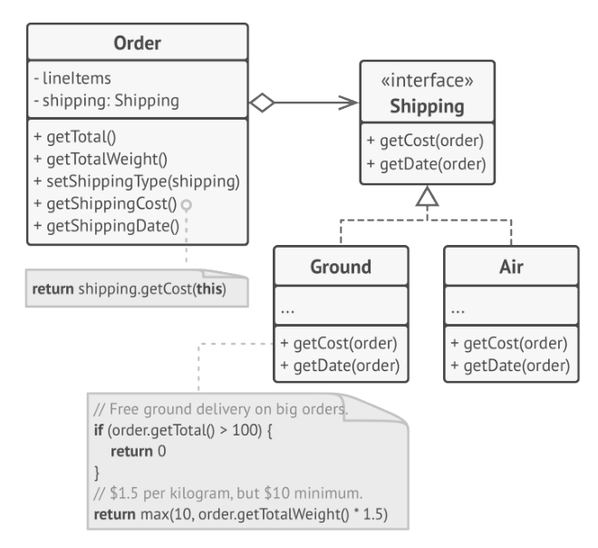
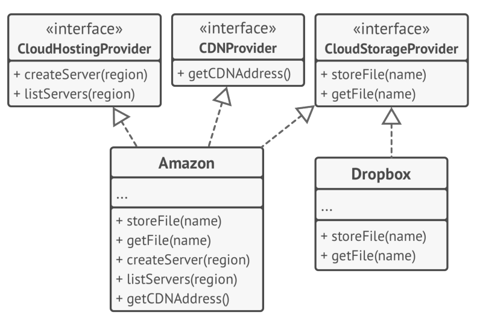

# Features of Good Design

## Code reuse

Cost and times are the most valuable metrics when developing any software. Less time in development means faster time-to-market and less money spent on it means more money for marketing to reach new customers.

**Code reuse** (or **DRY** - Don't Repeat Yourself) it's the common way to reduce development costs - and it's pretty obvious: instead of writing new code, why don't we reuse the existing one?

The idea looks great on paper, but it turns out that making existing code work in a new context usually takes extra effort.

Tight coupling between components, dependencies on concrete classes instead of interfaces, hardcoded operations — all of this reduces flexibility of the code and makes it harder to
reuse it.

Using design patterns is one way to increase flexibility of software components and make them easier to reuse. However, the complexity may increase.

Three levels of reuse can be identified:

- At the lowest level - we reuse classes: class libraries, containers and so on
- At highest level there are frameworks that identify the key abstraction (JUnit is an example of that)
- The middle level are the patterns - smaller and abstract than frameworks but larger than classes - they’re really a description about how a couple of classes can relate to and interact with each other. 
   
The level of reuse increases when you move from classes to patterns and finally frameworks.

## Extensibility

**Change** is the only constant thing in a programmer's life.

- you released a video game for Windows - now you need to write a MacOS version
- you createad nice GUI framework with square - now you now need to implement round ones 
- your ecommerce site sends email to customers - now you need to call them using VOIP

There are several reason for this to happens.

1. we understand the problem better once we start to solve it - most of the time when you finish to solve it. Often by the time you finish the first version of an app or a module it's time to rewrite it from scratch because now you undersand many aspects much better.

2. something beyond your control has changed like a thechnical constraint emerging - remember when Flash in the online ecosystem was dropped?

3. requirements from the client changes everytime - 3 "small changes" from the client may be a week of refactoring

Avoiding changes is impossible, but a good developer try to provide for possible future changes when designing architetures.

# Design principles

## Encapsulate what varies

`Identify the aspects of your application that vary and separate them from what stays the same.`

The main goal of this principles is to minimize the effect caused by changes.

By isolating the parts of the application that varies in indipendent modules you effectively protect the rest of codes from adverse effects. 
By doing this you spend less time getting the program back into working shape, implementing and testing the changes: less time spent making changes means more time to implement features.

### Encapsulate on method level

In your e-commerce app there's a method that get the total of the order, `getOrderTotal` - by taking into account taxes from the US or the EU

```java
public Double getOrderTotal(final Order order){
    Double total = 0.0d;
    for(Item item : order.getPurchasedItems()){
        total += item.getPrice();
    }
    if(Country.US == order.getCountry()){
        total += total * 0.07;
    } else if((Country.EU == order.getCountry()){
        total += total * 0.20;        
    }
    return total;
}
```
this works, but changing the tax calculation logic result in changing the order total calculation. 
We can extract the tax calculation in another method - separating the two operations.

```java
public Double getOrderTotal(final Order order){
    Double total = 0.0d;
    for(Item item : order.getPurchasedItems()){
        total += item.getPrice();
    }
    total += total * this.getTaxForCountry(order.getCountry());
    return total;
}

public Double  getTaxForCountry(final Country country){
    if(Country.US == order.getCountry()){
        return 0.07;
    } 
    if((Country.EU == order.getCountry()){
        return 0.20;        
    }
    return 0.0d;
}
```

### Encapsulate on class level

Over the time may be the need of adding more methods to a class - giving to the class more responsability.

For example:

```java
public class OrderTotalCalculator(){

    private List<Item> purchasedItems;
    private Country country;
    private Address address;

    // more fields and getters and setters
    
    public Double getOrderTotal(final Order order){
        Double total = 0.0d;
        for(Item item : order.getPurchasedItems()){
            total += item.getPrice();
        }
        total += total * this.getTaxForCountry(order.getCountry());
        return total;
    }

    public Double  getTaxForCountry(final Country country){
        if(Country.US == order.getCountry()){
            return 0.07;
        } 
        if((Country.EU == order.getCountry()){
            return 0.20;        
        }
        return 0.0d;
    }
    
}
```

By looking at this class we see that calculating the tax is not a concern of the order total calculator, so we split the logic in a separated class:

```java
public class OrderTotalCalculator(){

    private List<Item> purchasedItems;
    private Country country;
    private Address address;

    // more fields and getters and setters
    
    public Double getOrderTotal(final Order order){
        Double total = 0.0d;
        for(Item item : order.getPurchasedItems()){
            total += item.getPrice();
        }
        total += total * TaxCalculator.getTaxForCountry(order.getCountry());
        return total;
    }
}

public class TaxCalculator(){

    // we can also encapsulate the calculation for each country in a separated method
    public static Double getTaxForCountry(final Country country){
        if(Country.US == order.getCountry()){
            return 0.07;
        } 
        if((Country.EU == order.getCountry()){
            return 0.20;        
        }
        return 0.0d;
    }
    
}
```

## Program to an interface, not an implementation

`Program to an interface, not an implementation. Depend on abstractions, not on concrete classes.`

You can tell that the design is flexible enough if you can easily extend it without breaking any existing code. 

Let's say your program mock a software company with different employees: programmers, testers, designers.

We have our classes for every role, and everyone has a different task.

```java
public void createSoftware(){
    Designer d = new Designer();
    d.designUI();

    Programmer p = new Programmer();
    p.writeCode();

    Tester t = new Tester();
    t.testCode();
}
```

Hiring a software architecht need a change in the logic:

```java
public void createSoftware(){
    Designer d = new Designer();
    d.designUI();

    Architect a = new Architect();
    a.designArchitecture();

    Programmer p = new Programmer();
    p.writeCode();

    Tester t = new Tester();
    t.testCode();
}
```

Coding to interface and not to implementation is way more extensibile:

```java
public void createSoftware(){
    Employee d = new Designer();
    Employee a = new Architect();
    Employee p = new Programmer();
    Employee t = new Tester();
    
    final List<Employee> employees = new ArrayList();
    employees.add(d);
    employees.add(a);
    employees.add(p);
    employees.add(t);
    
    for(Employee e : employees){
        e.work();
    }
}
```

Adding a new type of employee doesn't break the code.

## Favor composition over inheritance

Inheritance is probably the most obvious and easy way of reusing code between classes. 
You have two classes with the same code. 
Create a common base class for these two and move the similar code into it. Easy!

Unfortunately, inheritance comes with some downsides, that often becomes apparent only after your project has tons of interfaces:

1. *a subclass can't reduce the interface of the superclass* - you have to implement all abstract methods even if you won't be using the,
2. *when overriding methods you need to make sure that the behaviour is compatible with the base one* - objects of the subcalss may be passed to any code that expects objects of the superclass and you don't want that code to break
3. *inheritance breaks encapsulation of the superclass* - the internal details of the parent class become available to the subclass
4. *subclasses are tightly coupled to superclasses* - any change in superclass may break the functionality of subclasses
5. *reusing code through inheritance can lead to parallel inheritance hierarchies* - inheritance usually takes place in a single dimension - having more than one create complex subclass combinations

There’s an alternative to inheritance called composition.

Whereas inheritance represents the “is a” relationship between classes (_a car is a transport_), **composition** represents the “has a” relationship (_a car has an engine_).

This principle also applies to **aggregation** — a relaxed variant of composition where one object may have a reference to the other one but doesn’t manage its lifecycle: a car _has a_ driver, but the driver use another method of transport or just walk _without the car_.

See the examples:


# SOLID principles

SOLID is a mnemonic for five design principles intended to make software desings more understandable, flexible and maintanable.

> As with everything in life, using these principles mindlessly can cause more harm than good. 
The cost of applying these principles into a program’s architecture might be making it more complicated than it should be. 
>
> Striving for these principles is good,
but always try to be pragmatic and don’t take everything writ-
ten here as dogma.

## **S**ingle responsibility principle

> A class should have just one reason to change

Try to make every class responsible for a single part of the functionality provided by the software, and make that responsibility hidden within the class.

This principle let you reduce complexity: there's no need to write 400 lines algorithms, but it's better to write a dozen methods inside a class.

The real problem is when your program grows and changes: at some point classes become so big that you can't remember the details of their implementation.

Another problem is when a class do too many things: you have to change that class every time there's a need for a change in a functionality that the class should not manage - risking to breaking other parts of the class which you didn't want to change.

> If you feel that it’s becoming hard to focus on specific aspects of the program one at a time, remember the single responsibiity principle and check whether it’s time to divide some classes into parts.

**Example**

This `Employee` class has several reason to change. 
The first is managing employee data, while the second is the timesheet report export, which may change over time - requiring you to change the code within the class.


Solve the problem by moving the behavior related to printing timesheet reports into a separate class. 
This change lets you move other report-related stuff to the new class.


## **O**pen/Closed Principle

> Classes should be open for extension but closed for modification.

The main idea of this principle is to keep existing code from breaking when you implement new features.

A class is open if you can extend it, produce a subclass and do whatever you want with it—add new methods or fields, override base behavior, etc. 

At the same time, the class is closed (you can also say complete) if it’s 100% ready to be used by other classes — its interface is clearly defined and won’t be changed in the future.

If a class is already developed, tested, reviewed, and included in some framework or otherwise used in an app, trying to mess with its code is risky. 

Instead of changing the code of the class directly, you can create a subclass and override parts of the original class that you want to behave differently. 

You’ll achieve your goal but also won’t break any existing clients of the original class.

This principle isn’t meant to be applied for all changes to a class. If you know that there’s a bug in the class, just go fix it.

**Example**

You have an e-commerce application with an `Order`` class that calculates shipping costs and all shipping methods are hard-coded inside the class. 

If you need to add a new shipping method, you have to change the code of the Order class and risk breaking it.


Start by extracting shipping methods into separate classes with a common interface.



Now when you need to implement a new shipping method, you can derive a new class from the `Shipping` interface without touching any of the `Order` class’ code. 

Bonus: we also applied single responsibility principle

## **L**iskov Substition Principle

> When extending a class, remember that you should be able to pass objects of the subclass in place of objects of the parent class without breaking the client code.

This means that the subclass should remain compatible with the behavior of the superclass. 

When overriding a method, extend the base behavior rather than replacing it with something else entirely.

The substitution principle is a set of checks that help predict whether a subclass remains compatible with the code that was able to work with objects of the superclass. 

There is a set of formal rules for this principle:

1. **Parameter types in a method of a subclass should match or be more abstract than parameter types in the method of the superclass**
  
  Say there’s a class with a method that’s supposed to feed cats: `feed(Cat c)` - client code always passe cat objects into this method.

**GOOD**: you created a subclass that overrode the method so that it can feed any animal (a superclass of cats): `feed(Animal c)`. Now if you pass an object of this subclass instead of an object of the superclass to the client code, everything would still work fine. The method can feed all animals, so it can still feed any cat passed by the client.

**BAD**: you created another subclass and restricted the feeding method to only accept Bengal cats (a subclass of cats): `feed(BengalCat c)` . What will happen to the client code if you link it with an object like this instead of with the original class? Since the method can only feed a specific breed of cats, it won’t serve generic cats passed by the client, breaking all related functionality.

2. **The return type in a method of a subclass should match or be a subtype of the return type in the method of the superclass** 

As you can see, requirements for a return type are inverse to requirements for parameter types. Say you have a class with a method `buyCat(): Cat` - the client code expects to receive any cat as a result of executing this method.

**GOOD**: a subclass overrides the method as follows: `buyCat(): BengalCat` - the client gets a Bengal cat, which is still a cat, so everything is okay.

**Bad**: a subclass overrides the method as follows: `buyCat(): Animal` - now the client code breaks since it receives an unknown generic animal (an alligator? a bear?) that doesn’t fit a structure designed for a cat.

3. **A method in a subclass shouldn’t throw types of exceptions which the base method isn’t expected to throw**

Types of exceptions should match or be subtypes of the ones that the base method is already able to throw.
This rule comes from the fact that try-catch blocks in the client code target specific types of exceptions which the base method is likely to throw: an unexpected exception can crash the entire application.

In most modern programming languages, especially statically typed ones (Java, C#, and others), these rules are
built into the language. You won’t be able to compile a program that violates these rules.

4. **A subclass shouldn’t strengthen pre-conditions** 

For example, the base method has a parameter with type `int`.
If a subclass overrides this method and requires that the value of an argument passed to the method should be positive (by throwing an exception if the value is negative), this strengthens the pre-conditions. 

The client code, which used to work fine whenpassing negative numbers into the method, now breaks if it
starts working with an object of this subclass.

5. **A subclass shouldn’t weaken post-conditions**
   
Say you have a class with a method that works with a database. 
A method of the class is supposed to always close all opened database connections upon returning a value.

You created a subclass and changed it so that database connections remain open so you can reuse them. But the client might not know anything about your intentions.

Because it expects the methods to close all the connections, it may simply terminate the program right after calling the method, polluting a system with ghost database connections.

6. **Invariants of a superclass must be preserved**
   
`Invariants` are conditions in which an object makes sense. 

For example, invariants of a cat are having four legs, a tail, ability to meow, etc. 

The confusing part about invariants is that while they can be defined explicitly in the form of interface contracts or a set of assertions within methods, they could also be implied by certain unit tests and
expectations of the client code.

The rule on invariants is the easiest to violate because you might misunderstand or not realize all of the invariants of a complex class.

7. **A subclass shouldn’t change values of private fields of the superclass**

Some programming languages let you access private members of
a class via reflection mechanisms. Other languages (Python, JavaScript) don’t have any protection for the private members at all. _Don't do that._

## **I**nterface Segregation Principle

> Clients shouldn’t be forced to depend on methods they do not use

Try to make your interfaces narrow enough that client classes don’t have to implement behaviors they don’t need.

According to the interface segregation principle, you should break down “fat” interfaces into more granular and specific ones. 

Clients should implement only those methods that they really need. Otherwise, a change to a “fat” interface would break even clients that don’t use the changed methods.

Class inheritance lets a class have just one superclass, but it doesn’t limit the number of interfaces that the class can implement at the same time. 

Hence, there’s no need to cram tons of unrelated methods to a single interface. 

Break it down into several more refined interfaces — you can implement them all in a single class if needed. However, some classes may be fine with implementing just one of them.

**Example**

Imagine that you created a library that makes it easy to integrate apps with various cloud computing providers. 

While in the initial version it only supported Amazon Cloud, it covered the full set of cloud services and features.

At the time you assumed that all cloud providers have the same broad spectrum of features as Amazon. But when it came to implementing support for another provider, it turned out that most of the interfaces of the library are too wide.

Some methods describe features that other cloud providers just don’t have.


While you can still implement these methods and put some stubs there, it wouldn’t be a pretty solution. 

The better approach is to break down the interface into parts. 
Classes that are able to implement the original interface can now just implement several refined interfaces. 

Other classes can implement only those interfaces which have methods that make sense for them.



As with the other principles, you can go too far with this one.

Don’t further divide an interface which is already quite specific. 
Remember that the more interfaces you create, the more complex your code becomes. Keep the balance.

## **D**ependency Inversion Principle

> High-level classes shouldn’t depend on low-level classes.
> Both should depend on abstractions. 
> Abstractions shouldn’t depend on details. 
> Details should depend on abstractions.

Usually when designing software, you can make a distinction between two levels of classes.
- **Low-level classes** implement basic operations such as working with a disk, transferring data over a network, connecting to a database, etc.
- **High-level classes** contain complex business logic that directs low-level classes to do something.

Sometimes people design low-level classes first and only then start working on high-level ones. 

This is very common when you start developing a prototype on a new system, and you’re not even sure what’s possible at the higher level because low-level stuff isn’t yet implemented or clear. 

With such an approach business logic classes tend to become dependent on primitive low-level classes.

The dependency inversion principle suggests changing the direction of this dependency.

1. For starters, you need to describe interfaces for low-level operations that high-level classes rely on, preferably in business terms. For instance, business logic should call a method `openReport(file)`, rather than a series of methods `openFile(x)`, `readBytes(n)`, `closeFile(x)``
2. Now you can make high-level classes dependent on those interfaces, instead of on concrete low-level classes. This dependency will be much softer than the original one.
3. Once low-level classes implement these interfaces, they become dependent on the business logic level, reversing the direction of the original dependency.

The dependency inversion principle often goes along with the open/closed principle: you can extend low-level classes to use with different business logic classes without breaking existing classes.

**Example**

In this example, the high-level budget reporting class uses a low-level database class for reading and persisting its data.

This means that any change in the low-level class, such as when a new version of the database server gets released, may affect the high-level class, which isn’t supposed to care about the data storage details.


You can fix this problem by creating a high-level interface that describes read/write operations and making the reporting class use that interface instead of the low-level class.

Then you can change or extend the original low-level class to implement the new read/write interface declared by the business logic.


As a result, the direction of the original dependency has been inverted: low-level classes are now dependent on high-level abstractions.