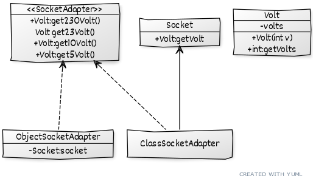
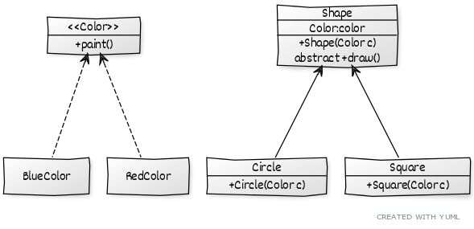
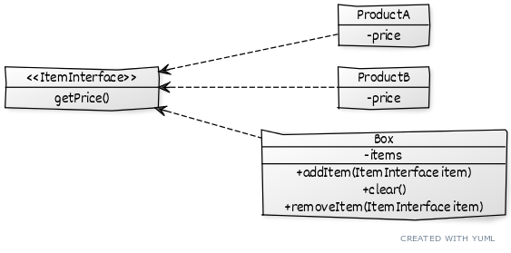
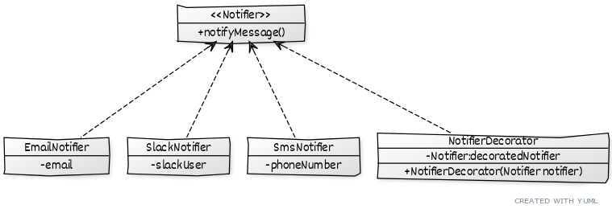
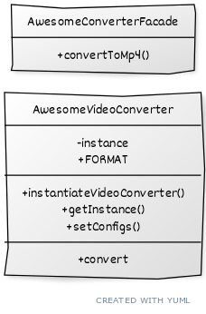

# Index
1. [Adapter](#adapter)
2. [Bridge](#bridge)
3. [Composite](#composite)
4. [Decorator](#decorator)
5. [Facade](#facade)
6. [Flyweight](#flyweight)
7. [Proxy](#proxy)

<a name="adapter"></a>
# Adapter pattern [\^](#index)

## Description
Adapter is a structural design pattern that allows objects with incompatible interfaces to collaborate.

## The problem

Your application mock how a wall charger works. You have a tension of 230V but you need to be able to charge at 5V, 10V and 23V. This is a perfect example of adapter pattern!

## The solution

Let's start by defining `Volt` class:
```java
public class Volt {

	private int volts;
	
	public Volt(int v){
		this.volts=v;
	}

	public int getVolts() {
		return volts;
	}

	public void setVolts(int volts) {
		this.volts = volts;
	}
	
}
```

and the `Socket` class, which erogates 230V:

```java
public class Socket {

	public Volt getVolt(){
		return new Volt(230);
	}
}
```

We now declare the `SocketAdapter` interface:

```java
public interface SocketAdapter {

	public Volt get230Volt();
		
	public Volt get23Volt();
	
	public Volt get10Volt();
	
	public Volt get5Volt();

}
```

### Class inheritance approach

This approach uses inheritance:

```java
public class ClassSocketAdapter extends Socket implements SocketAdapter{

	@Override
	public Volt get230Volt() {
		return getVolt();
	}

	@Override
	public Volt get23Volt() {
		Volt v= getVolt();
		return convertVolt(v,10);
	}

	@Override
	public Volt get10Volt() {
		Volt v= getVolt();
		return convertVolt(v,23);
	}
	
	@Override
	public Volt get5Volt() {
		Volt v= getVolt();
		return convertVolt(v,46);
	}
	
	private Volt convertVolt(Volt v, int i) {
		return new Volt(v.getVolts()/i);
	}

}
```
## Object composition approach

This approach uses composition:
```java
public class ObjectSocketAdapter implements SocketAdapter {

	// Using composition for adapter pattern
	private Socket socket = new Socket();

	@Override
	public Volt get230Volt() {
		return socket.getVolt();
	}

	@Override
	public Volt get23Volt() {
		Volt v = socket.getVolt();
		return convertVolt(v, 10);
	}

	@Override
	public Volt get10Volt() {
		Volt v = socket.getVolt();
		return convertVolt(v, 23);
	}

	@Override
	public Volt get5Volt() {
		Volt v = socket.getVolt();
		return convertVolt(v, 46);
	}

	private Volt convertVolt(Volt v, int i) {
		return new Volt(v.getVolts() / i);
	}

}
```

Both approaches are good (note that we can transform the interface in abstract class and extract the method `convertVolt` there)

Our application will work this way:
```java
  SocketAdapter objectAdapter = new ObjectSocketAdapter();
  System.out.println(objectAdapter.get5Volt().getVolts() + " V");
  
  SocketAdapter classAdapter = new ClassSocketAdapter();
  System.out.println(classAdapter.get23Volt().getVolts() + " V");
```

which output:
```
5 V
23 V
```

## Pros and Cons

✔ you can separate the interface or data conversion code from the primary business logic of the program

✔ you can introduce new types of adapters into the program without breaking the existing client code, as long as they work with the adapters through the client interface

❌ The overall complexity of the code increases because you need to introduce a set of new interfaces and classes. Sometimes it’s simpler just to change the service class so that it matches the rest of your code


## UML


## When to use

- use the adapter class when you want to use some existing class but the interface is not compatible with your code: this class acts like a middle layer translating between your code and other classes.
- reuse several existing subclasses that lack some common functionality that can’t be added to the superclass: each subclass could be extended putting the missing functionality into new child classes. However, you’ll need to duplicate the code across all of these new classes: putting the missing funcionality in the adapter is much more elegant. For this to work, the target classes must have a common interface, and the adapter’s field should follow that interface.
---

<a name="bridge"></a>
# Bridge pattern [\^](#index)

## Description
Bridge is a structural design pattern that lets you split a large class or a set of closely related classes into two separate hierarchies—abstraction and implementation—which can be developed independently of each other.

## The problem

In your application lives a `Shape` interface which is implemented by a couple of shapes like `Square` and `Circle`. Say you need to draw red and blue circle. One approach would be to create a `BlueCircle` and a `RedCircle`.
This is not good because class will grow exponentially when adding a yellow color and a `Triangle`

## The solution

This problem occurs because we’re trying to extend the shape classes in two independent dimensions: by form and by color - a very common issue with class inheritance.

The Bridge pattern attempts to solve this problem by switching from inheritance to composition: one dimension is extracted into a separate class hierarchy, so that the original classes will reference an object of the new hierarchy, instead of having all of its state and behaviors within one class.

Following this approach, we can extract the color-related code into its own class with two subclasses:
`Red` and `Blue` . The Shape class then gets a reference field pointing to one of the color objects delegating any color-related work to the linked color object. 

That reference will act as a bridge between the `Shape` and `Color` classes: adding new colors won’t require changing the shape hierarchy, and viceversa.

Let's start by defining the `Color` interface which will have a `paint()` method:

```java
public interface Color {
	
	public void paint();

}
```

and the `RedColor`, `BlueColor` classes:

```java
public class RedColor implements Color {

	@Override
	public void paint() {
		System.out.println("red");
	}

}
```
```java
public class BlueColor implements Color {

	@Override
	public void paint() {
		System.out.println("blue");
	}

}
```

Then let's define the `Shape` abstract class, which will have a `Color`, bridging the shape with the color

```java
public abstract class Shape {
	
	protected Color color;
	
	public Shape(final Color c) {
		this.color = c;
	}
	
	public abstract void draw();

}
```

and the `Square`, `Circle` classes:

```java
public class Circle extends Shape {

	public Circle(Color c) {
		super(c);
	}

	@Override
	public void draw() {
		System.out.print("Circle filled with color ");
		color.paint();
	}

}
```
```java
public class Square extends Shape {

	public Square(Color c) {
		super(c);
	}

	@Override
	public void draw() {
		System.out.print("Square filled with color ");
		color.paint();
	}

}
```

Our application will work this way:
```java
Shape redSquare = new Square(new RedColor());
redSquare.draw();
Shape blueCircle = new Circle(new BlueColor());
blueCircle.draw();
```

outputting:
```
Square filled with color red
Circle filled with color blue
```
## Pros and Cons

✔ You can create platform-independent classes and apps

✔ The client code works with high-level abstractions and it's not exposed to the platform details.

✔ You can introduce new abstractions and implementations independently from each other

✔ You can focus on high-level logic in the abstraction and on platform details in the implementation

❌ You might make the code more complicated by applying the pattern to a highly cohesive class

## UML


## When to use

- there is the need to  extend a class in several independent dimensions (Color and Shape from the example)
- if you need to be able to switch implementations at runtime, with bridge pattern is easy as changing a field in "normal" class
---
<a name="composite"></a>
# Composite pattern [\^](#index)

## Description
Composite is a structural design pattern that lets you compose objects into tree structures and then work with these structures as if they were individual objects.

## The problem

Your application has a shopping section which handles orders represented by boxes and products. 
A boxes can contain a product or more, product(s) and box(es) which can also contain(s) more product(s).
What is the easiest way to calculate the price of the items inside a box?

## The solution

We define the `Box` and `Product` class which will extends/implement an abstract class/an interface which has a method for calculating the price.
The product will simply return the product price while the box will iterate through all the products inside it.

```java
public interface ItemInterface {
	
	public Double getPrice();
	
}
```

```java
public class Box implements ItemInterface {
	
	private final List<ItemInterface> items = new ArrayList<ItemInterface>();
	
	public void addItem(final ItemInterface item) {
		this.items.add(item);
	}
	
	public void clear() {
		this.items.clear();
	}
	
	public void removeItem(final ItemInterface item) {
		this.items.remove(item);
	}
	
	@Override
	public Double getPrice() {
		return this.items.isEmpty() ? 0d : this.items.stream().collect(Collectors.summingDouble(ItemInterface::getPrice));
	}

}
```

```java
public class ProductA implements ItemInterface {
	
	private final double price = 10.5d;
	
	@Override
	public Double getPrice() {
		return price;
	}

}
```

```java
public class ProductB implements ItemInterface {
	
	private final double price = 5.5f;
	
	@Override
	public Double getPrice() {
		return price;
	}

}
```

our cart can then be something like this:
```java
Box bigBox = new Box();
bigBox.addItem(new ProductA());
bigBox.addItem(new ProductB());
Box smallBox = new Box();
smallBox.addItem(new ProductA());
bigBox.addItem(smallBox);
System.out.println(bigBox.getPrice());
```
which output the correct value of `26.5`

## Pros and Cons

✔ You can work with complex tree/hierarchical structures more conveniently: use polymorphism and recursion to your advantage

✔ You can introduce new element types into the app without breaking the existing code, which now works with the object tree

❌ It might be difficult to provide a common interface for classes whose functionality differs too much: you would need to overgeneralize the component interface, making it harder to comprehend.

## UML



## When to use

- there is the need to implement a tree-like strutcture
- simple and complex element should be treated equally
---

<a name="decorator"></a>
# Decorator pattern [\^](#index)

## Description
Decorator is a structural design pattern that lets you attach new behaviors to objects by placing these objects inside special wrapper objects that contain the behaviors.

## The problem

You are working on a notification library that notify user by sending emails, using a simple `Notifier` class which has a `notify()` method.

At some point you need to implement an SMS sender class, so te original class becomes an interface implemented by `EmailNotifier` and `SmsNotifier`, both of them implementing the `send()` method.
Business user then needs to receiver notification on Facebook (`FacebookNotifier`) and Slack (`SlackNotifier`).

How hard can it be? Then you realize that someone may needs more than one notification type at once for a given event (if your production server explodes you want to be notified on every avalaible channel), leading to an explosion of combinations of the notifiers.

We need to find a way to modify the entity behaviour (in our case the notifier) at runtime, by "decorating" with the notification needed.

## The solution

We implement the `Notifier` interface, with a single `notifyMessage` method - `notify` is a reserved method in Java ;)

```java
public interface Notifier {
	
	public void notifyMessage();

}
```

We then choose a basic implementation, which contains something that must be done every time (send the email)

 `EmailNotifier`:
```java
public class EmailNotifier implements Notifier {

	private String email;
	
	public EmailNotifier(final String email) {
		this.email = email;
	}
	
	@Override
	public void notifyMessage() {
		System.out.println("Sending email notification to " + email);
	}

}
```

We then proceed to implement the decorator itself, the `NotifierDecorator`:

```java
public abstract class NotifierDecorator implements Notifier {
	private final Notifier decoratedNotifier;
	
	protected NotifierDecorator(Notifier notifier) {
		this.decoratedNotifier = notifier;
	}
	
	@Override
	public void notifyMessage() {
		this.decoratedNotifier.notifyMessage();
	}
	
}
```

The `SmsNotifier` and `SlackNotifier` will extends the decorator class:

```java
public class SmsNotifier extends NotifierDecorator {

	private String phoneNumber;
	
	public SmsNotifier(Notifier notifier, final String phoneNumber) {
		super(notifier);
		this.phoneNumber = phoneNumber;
	}
	
	
	@Override
	public void notifyMessage() {
		System.out.println("Sending sms to " + phoneNumber);
	}

}
```
```java
public class SlackNotifier extends NotifierDecorator {

	private String slackUser;
	
	public SlackNotifier(Notifier notifier, final String slackUser) {
		super(notifier);
		this.slackUser = slackUser;
	}
	
	@Override
	public void notifyMessage() {
		System.out.println("Sending slack notification to " + slackUser);
	}

}
```

Our application then can simply call the notifier needed without bloating the code:

```java
final String emailAddress = "bogus@binted.com";
final String slackUser = "@binted";
final String phoneNumber = "+1 515-JAVA";

Notifier notifier = new EmailNotifier(emailAddress);
notifier.notifyMessage();
notifier = new SlackNotifier(notifier, slackUser);
notifier.notifyMessage();
notifier = new SmsNotifier(notifier, phoneNumber);
notifier.notifyMessage();

```

which will output:

```
Sending email notification to bogus@binted.com
Sending slack notification to @binted
Sending sms to +1 515-JAVA

```

Another example is a cafeteria, where every decorator uses the information from the base object.

```java
interface Beverage {
    String getDescription();
    double cost();
}

class Espresso implements Beverage {
    @Override
    public String getDescription() {
        return "Espresso";
    }

    @Override
    public double cost() {
        return 1.99;
    }
}
```
```java
abstract class BeverageDecorator implements Beverage {
    protected Beverage beverage;

    public BeverageDecorator(Beverage beverage) {
        this.beverage = beverage;
    }

    @Override
    public String getDescription() {
        return beverage.getDescription();
    }

    @Override
    public double cost() {
        return beverage.cost();
    }
}

class MilkDecorator extends BeverageDecorator {
    public MilkDecorator(Beverage beverage) {
        super(beverage);
    }

    @Override
    public String getDescription() {
        return beverage.getDescription() + ", Milk";
    }

    @Override
    public double cost() {
        return beverage.cost() + 0.50;
    }
}

class WhippedCreamDecorator extends BeverageDecorator {
    public WhippedCreamDecorator(Beverage beverage) {
        super(beverage);
    }

    @Override
    public String getDescription() {
        return beverage.getDescription() + ", Whipped Cream";
    }

    @Override
    public double cost() {
        return beverage.cost() + 0.70;
    }
}

```
Il cui client a runtime estende il comportamento base:

```java
public class CoffeeShop {
    public static void main(String[] args) {
        Beverage beverage = new Espresso();
        System.out.println(beverage.getDescription() + " $" + beverage.cost());

        beverage = new MilkDecorator(beverage);
        System.out.println(beverage.getDescription() + " $" + beverage.cost());

        beverage = new WhippedCreamDecorator(beverage);
        System.out.println(beverage.getDescription() + " $" + beverage.cost());
    }
}
```
```
Espresso $1.99
Espresso, Milk $2.49
Espresso, Milk, Whipped Cream $3.19
```
## Pros and Cons

✔ an object’s behavior can be extended without making a new subclass

✔ You can add or remove responsibilities from an object at runtime

✔ Several behaviors can be combined by combining different decorators

❌ it’s hard to remove a specific wrapper from the wrappers stack.

❌ it’s hard to implement a decorator in such a way that its behavior doesn’t depend on the order in the decorators stack

## UML


## When to use

- you want to assign extra behaviour to objects at runtime without breaking the code that use these objects
- it's not possible to extend a behaviour using inheritance

---
<a name="facade"></a>
# Facade pattern [\^](#index)

## Description

Facade is a structural design pattern that provides a simplified interface to a library, a framework, or any other complex set of classes.
## The problem

Usually, an enterprise application needs to work with a broad set of objects from different sources. You would need to managate them all, keeping track of initialization, execute methods in order and so on, resulting in the business logic of application classes being tightly coupled to the implementation of 3rd party classes, making maintenance hard.

## The solution
A facade is a class that provides a simple interface to complex subsystems, hiding the logic to the application and exposing only the methods the application need.

Let's say that your application need to convert videos to MP4 format, and the `AwesomeVideoConverter` class (which is third party) is used. This class exposes lot of methods, most of them we don't care about.

```java
public class AwesomeVideoConverter {

	private static AwesomeVideoConverter instance;

	public enum FORMAT {
		MP4, AVI
	}

	public static void instantiateVideoConverter() {
		instance = new AwesomeVideoConverter();
	}

	public static AwesomeVideoConverter getInstance() {
		if (instance == null) {
			instantiateVideoConverter();
		}
		return instance;
	}

	public void setConfigs() {
		// set configs here
	}

	public void convert(final String filename, final FORMAT destinationFormat) {
		switch (destinationFormat) {
		case AVI:
			System.out.println("Converted " + filename + " to AVI");
			break;
		case MP4:
			System.out.println("Converted " + filename + " to MP4");
		default:
			break;
		}
	}

	// more methods - for encoding, compression, cropping, scaling...
}
```

We care only of converting a video file, so we can write our `AwesomeConverterFacade` that expose a single method, `convertToMp4(...)`

```java
public class AwesomeConverterFacade {

	public static void convertToMp4(final String filename) {
		final AwesomeVideoConverter conv = AwesomeVideoConverter.getInstance();
		conv.setConfigs();
		conv.convert(filename, FORMAT.MP4);
	}

}
```

In this way the application can simply call:
```java
AwesomeConverterFacade.convertToMp4("/videos/banana.avi");
```
hiding completely the inner logic of the converter.

While adapter pattern tries to make the existing interface usable, facade defines a new interface for existing objects. Adapter usually wraps just one object while the facade works with a more complex subsystem.


## Pros and Cons

✔ you can isolate your code from the complexity of a subsystem

❌ a facade can become a god object coupled to all classes of an app

## UML


## When to use

- you need to have a limited but straightforward access to a complex third party library
- by using this pattern is also possiblo to structure a subsystem into layers by writing a facade for all of them

---
<a name="flyweight"></a>
# Flyweight pattern [\^](#index)

## Description
Flyweight is a structural design pattern that lets you fit more objects into the available amount of RAM by sharing common parts of state between multiple objects instead of keeping all of the data in each object.

## The problem
Our application needs to draw a lot of different circles of different colours. We notice that the use of RAM is critical, so we need to save memory; we also notice that the color of the circle is the most expensive (in term of RAM usage). There is the need so to optimize memory usage.

## The solution
The first step of implementing the flyweight design pattern is to define what the *intrinsic* and *extrinsic* state of a object is.

The *intrinsic* state of an object is the constant data of an object, that lives inside the objects and most of the time is immutable: other objects can only read it, not change it.
The *extrinsic* state of an object is what depends on the context, often altered from outside the object.

Let's assume that we have a `Circle` class:
```java
public class Circle {
	private final String color;
	private int x;
	private int y;
	private int radius;

	public Circle(final String color) {
		System.out.println("Creating circle of color : " + color);
		this.color = color;
	}

	public void setX(final int x) {
		this.x = x;
	}

	public void setY(final int y) {
		this.y = y;
	}

	public void setRadius(final int radius) {
		this.radius = radius;
	}

	public void draw() {
		System.out.println(
				"[Color : " + this.color + ", x : " + this.x + ", y :" + this.y + ", radius :" + this.radius + "]");
	}
}
```

By using the definition of *intrinsic*/*extrinsic* state we see that the `color` is *intrinsic*, while the coordinates and radius are *extrinsic*

We want to generate 10 circles:
```java
for (int i = 0; i < 10; i++) {
			final Circle circle = new Circle(getRandomColor());
			circle.setX(r.nextInt(100));
			circle.setY(r.nextInt(100));
			circle.setRadius(50);
			circle.draw();
		}
```

The output is:
```
Creating circle of color : Red
[Color: Red, x :91, y:22, radius:39]
Creating circle of color : Blue
[Color: Blue, x :52, y:15, radius:11]
Creating circle of color : Red
[Color: Red, x :57, y:27, radius:12]
Creating circle of color : Red
[Color: Red, x :57, y:3, radius:18]
Creating circle of color : White
[Color: White, x :4, y:10, radius:48]
Creating circle of color : Blue
[Color: Blue, x :3, y:27, radius:33]
Creating circle of color : Green
[Color: Green, x :99, y:65, radius:40]
Creating circle of color : Black
[Color: Black, x :25, y:34, radius:7]
Creating circle of color : Blue
[Color: Blue, x :69, y:76, radius:32]
Creating circle of color : Red
[Color: Red, x :37, y:24, radius:18]
```
As we can see 10 circles are created.

By using a flyweight implementation of a factory, we can reduce the number of instances created:
```java
public class ShapeFactory {

	private static final Map<String, Circle> circleMap = new HashMap<>();

	public static Circle getCircle(final String color) {
		return circleMap.computeIfAbsent(color, k -> new Circle(color));
	}

}
```
Now, we can use it to draw the circles:
```java
for (int i = 0; i < 10; i++) {
			final Circle circle = ShapeFactory.getCircle(getRandomColor());
			circle.setX(r.nextInt(100));
			circle.setY(r.nextInt(100));
			circle.setRadius(r.nextInt(50));
			circle.draw();
		}
```

The output in this case will show:
```
Creating circle of color : Black
[Color: Black, x :71, y:92, radius:21]
Creating circle of color : Green
[Color: Green, x :39, y:50, radius:49]
Creating circle of color : White
[Color: White, x :95, y:8, radius:8]
[Color: White, x :65, y:14, radius:49]
[Color: Green, x :27, y:3, radius:25]
[Color: White, x :95, y:95, radius:24]
Creating circle of color : Blue
[Color: Blue, x :48, y:16, radius:29]
[Color: Black, x :70, y:81, radius:3]
[Color: White, x :53, y:24, radius:47]
Creating circle of color : Red
[Color: Red, x :21, y:0, radius:42]
```
informing us that only 5 circles are created. 
The memory occupation in last case is easily calculated: assuming we have 5 random colors the max number of circle in memory is 5, and it doesn't depends on how many circles I'm drawing (10, 100 or 2500).

For example, if:
- the color occupies 10KB
- the radius occupies 1KB
- the coordinates occupies 2KB

For 10'000 circles the memory occupation is:
- without flyweight: 10'000 * (10+1+2) = 130'000 KB = 130 MB
- with flyweight: (10*5) + 10'000 * (2+1) = 30'0050 KB = 30 MB

while the behaviour doesn't change. 

As a note, since the same flyweight object can be used in different contexts, you have to make sure that its state can’t be modified.
A flyweight should initialize its state just once, via constructor parameters. It shouldn’t expose any setters or public fields to other objects.

## Pros and Cons
✔ you can save lots of RAM, assuming your program has tons of similar objects

❌ you might be trading RAM over CPU cycles when some of the context data needs to be recalculated each time somebody calls a flyweight method

❌ the code becomes much more complicated. New team members will always be wondering why the state of an entity was separated in such a way

## When to use
  
- RAM is a critical resource that must be saved because a huge number of objects created

---

<a name="proxy"></a>
# Proxy pattern [\^](#index)

## Description
Proxy is a structural design pattern that lets you provide a substitute or placeholder for another object. A proxy controls access to the original object, allowing you to perform something either before or after the request gets through to the original object.
## The problem
Let’s say we have a class that can run some command on the system. 
Now if we are using it, its fine but if we want to give this program to a client application, it can have severe issues because client program can issue command to delete some system files or change some settings that you don’t want.

Here a proxy class can be created to provide controlled access of the program.
## The solution
Let's start by writing the `CommandExecutor` interface:
```java
public interface CommandExecutor {

	public void runCommand(String cmd) throws Exception;

}
```

and its basic implementation:
```java
public class CommandExecutorImpl implements CommandExecutor {

	@Override
	public void runCommand(final String cmd) throws IOException {
		// actually execute the command
		System.out.println("'" + cmd + "' command executed");
	}

}
```

We can define a proxy which implements the same interface, thus not having the need of changing the client code:

```java
public class CommandExecutorProxy implements CommandExecutor {

	private boolean isAdmin;
	private final CommandExecutor executor;

	public CommandExecutorProxy(final String user, final String pwd) {
		if ("admin".equals(user) && "a5)9=514dfm-".equals(pwd)) {
			this.isAdmin = true;
		}
		this.executor = new CommandExecutorImpl();
	}

	@Override
	public void runCommand(final String cmd) throws Exception {
		if (this.isAdmin) {
			this.executor.runCommand(cmd);
		} else if (cmd.trim().startsWith("rm")) {
			throw new Exception("rm command is not allowed for non-admin users");
		} else {
			this.executor.runCommand(cmd);
		}
	}

}
```

Now, in our simple application we can simply call the proxy:
```java
	final CommandExecutor executor = new CommandExecutorProxy("guest", "guest_pw");
		try {
			executor.runCommand("ls -halt");
			executor.runCommand(" rm -rf /");
		} catch (final Exception e) {
			System.out.println(e.getMessage());
		}
```
```
'ls -halt' command executed
rm command is not allowed for non-admin users
```

### Pros and Cons
✔ you can control the service object without clients knowing about it

✔ you can manage the lifecycle of the service object when clients don’t care about it

✔ the proxy works even if the service object isn’t ready or is not available

✔ you can introduce new proxies without changing the service or clients

❌ the code may become more complicated since you need to introduce a lot of new classes.

❌ the response from the service might get delayed.

## Use cases
  
### Virtual proxy

This is when you have a heavyweight service object that wastes system resources by being always up, even though you only need it from time to time.
Instead of creating the object when the app launches, you can delay the object’s initialization to a time when it’s really needed.

Example, loading an heavyweight image:
```java
interface Image {
    void display();
}

class RealImage implements Image {
    private String fileName;

    public RealImage(String fileName) {
        this.fileName = fileName;
        loadImageFromDisk();
    }

    private void loadImageFromDisk() {
        System.out.println("Loading image from disk: " + fileName);
    }

    @Override
    public void display() {
        System.out.println("Displaying image: " + fileName);
    }
}
```
```java
class ProxyImage implements Image {
    private RealImage realImage;
    private String fileName;

    public ProxyImage(String fileName) {
        this.fileName = fileName;
    }

    @Override
    public void display() {
        if (realImage == null) {
            realImage = new RealImage(fileName); // image is lazily loaded
        }
        realImage.display();
    }
}
```
```java
public class Client {
    public static void main(String[] args) {
        Image image = new ProxyImage("photo.jpg");

        // the image will be loaded only at first call to display
        System.out.println("Image will be displayed now:");
        image.display();
		// the image is already loaded and will only be displayed 
        System.out.println("Image will be displayed again:");
        image.display();  
    }
}
```
```
Image will be displayed now:
Loading image from disk: photo.jpg
Displaying image: photo.jpg

Image will be displayed again:
Displaying image: photo.jpg
```
### Protection proxy

By doing access control, a protection proxy can pass the request to the service only if some criteria are met.

### Remote proxy
This is when the service object is located on a remote server. 
In this case, the proxy passes the client request over the network, handling all of the nasty details of working with the network.

### Logging proxy

### Cache proxy